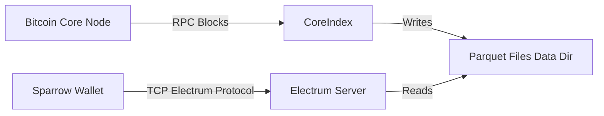

# How CoreIndex Works

CoreIndex is designed to be a lightweight yet high-performance Bitcoin indexer and Electrum server. Unlike traditional indexers that require heavy databases (like RocksDB or LevelDB), CoreIndex leverages **Apache Parquet** files and **Polars** for efficient, compressed, and columnar data storage.

## 1. Architecture Overview

CoreIndex operates as a bridge between a Bitcoin Core node and Electrum wallet clients (like Sparrow).

### Key Components
1.  **Indexer**: Fetches blocks from Bitcoin Core, extracts data, and writes it to partitioned Parquet files.
2.  **Electrum Server**: A high-concurrency `asyncio` TCP server that handles requests from wallets.
3.  **Storage Engine**: A pure-file-based database using Parquet. No external DB server is required.

---

## 2. Indexing Strategy & UTXO Lookup

To achieve high write throughput (sync speed) while maintaining fast read speeds for wallets, CoreIndex uses a **Two-Step Lookup Strategy**.

### The Problem
*   **Write Optimization**: When a new block arrives, we need to add new UTXOs and remove spent ones. This is easiest if data is keyed by `tx_hash` (Transaction ID).
*   **Read Optimization**: Wallets ask for "Balance of Address X". This requires data keyed by `scripthash` (Address).

### The Solution: Split Indexes

CoreIndex maintains two separate but linked datasets:

#### A. Address History Index (`data/addr_index/`)
*   **Purpose**: Maps an Address (Scripthash) to a list of Transaction IDs.
*   **Partitioning**: By the first byte of the Scripthash (e.g., `sh_prefix=a1`).
*   **Use Case**: "What transactions has this address been involved in?"

#### B. UTXO Database (`data/utxo/`)
*   **Purpose**: Stores the set of currently unspent outputs.
*   **Partitioning**: By the first byte of the Transaction ID (`tx_hash`).
*   **Use Case**: "Is Output 0 of Transaction ABC unspent?"

### The Lookup Flow (Sparrow Request)
When you ask for the balance of an address:

1.  **Step 1 (History)**: The server calculates the `scripthash` of your address. It scans the **Address History Index** to find all `tx_hash`es associated with it.
2.  **Step 2 (UTXO)**: Using that list of `tx_hash`es, it queries the **UTXO Database**. It checks which of these transactions still have unspent outputs.
3.  **Step 3 (Filter)**: It returns only the UTXOs that belong to your address (summing them for `get_balance`).

---

## 3. Silent Payments (BIP-352) Support

CoreIndex is "Silent Payments Ready". Silent Payments allow users to receive private payments without on-chain address reuse. However, scanning the chain for these payments is computationally expensive for light clients (phones/laptops).

CoreIndex helps by pre-calculating the heavy cryptography ("Tweaks") server-side.

### How it works:
1.  **Scan Taproot**: The indexer watches for transactions with **Taproot (P2TR)** outputs.
2.  **Extract Public Keys**: For every eligible input in such a transaction, it extracts the public key.
3.  **Compute Tweak**: It calculates the **Shared Secret Tweak** (Elliptic Curve Diffie-Hellman) for that transaction using the sum of input public keys.
4.  **Index**: This "Tweak" is saved to `data/tweaks/`.

### Client Benefit
A Silent Payments-aware wallet connecting to CoreIndex doesn't need to download full blocks or perform complex EC math for every transaction. It can simply download the small index of **Tweaks** and check if any of them match its own private keys.

---

## 4. BIP-158 Compact Block Filters

To support modern light clients (like Neutrino mode), CoreIndex generates **Golomb-Coded Sets (GCS)** for every block.

*   **What is it?**: A compressed probabilistic data structure that represents all scripts (addresses) inside a block.
*   **Why?**: A client can download this tiny filter (kilobytes) instead of the full block (megabytes) to check if the block contains relevant transactions.
*   **Privacy**: This preserves privacy better than BIP-37 bloom filters because the server gives the same filter to everyone; it doesn't know what you are looking for.
